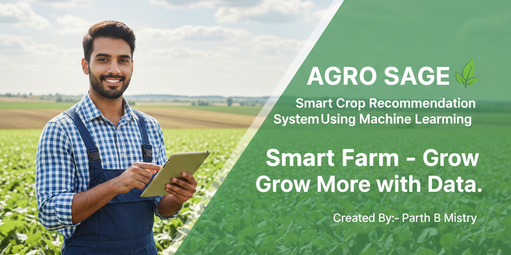
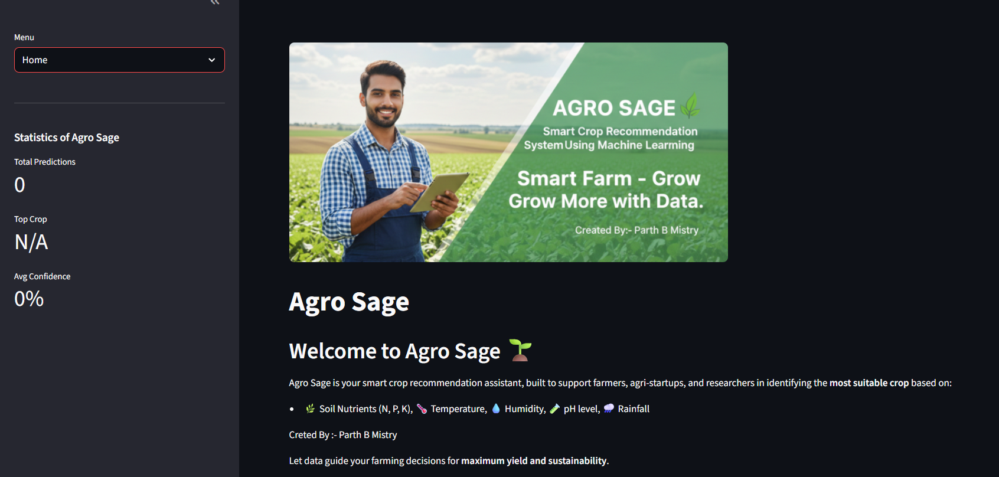
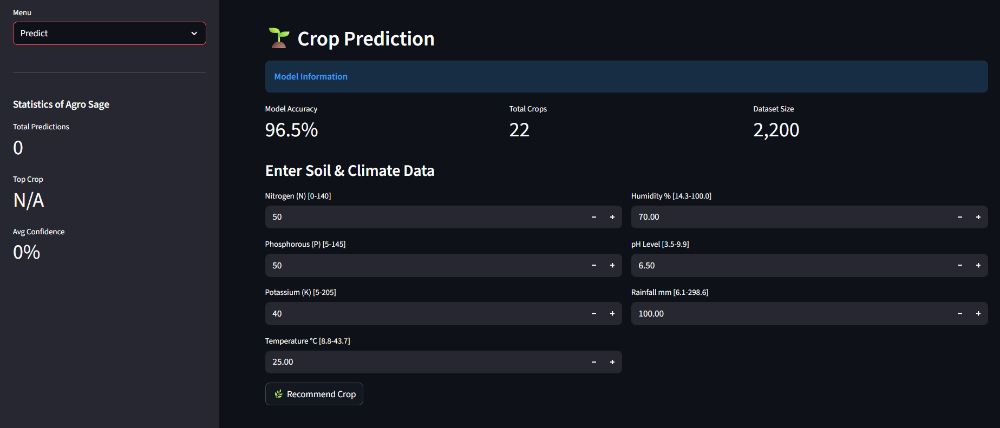
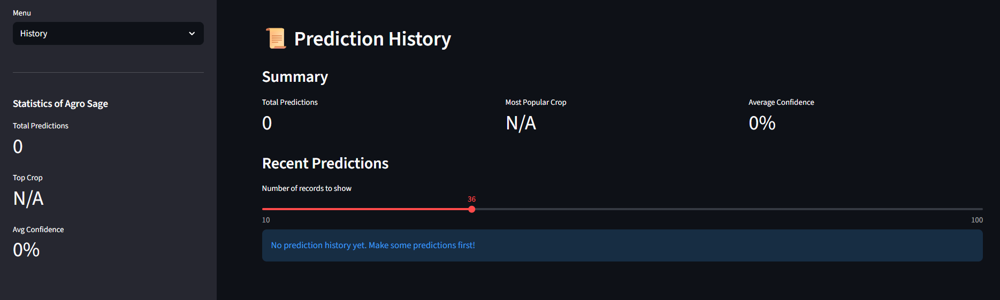
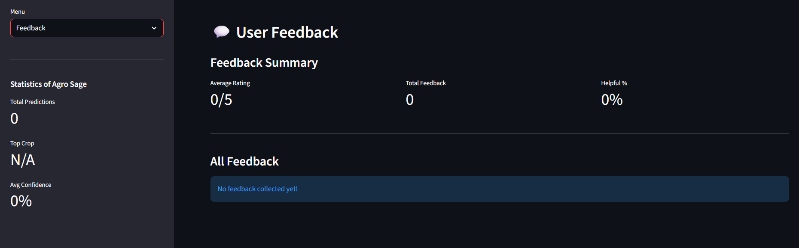

# AGRO SAGE 🌱
**Smart Crop Recommendation System Using Machine Learning**

---

**Domain:** Agriculture Technology (AgriTech)  
**Project Status:** ✅ **COMPLETED**  
**Created By:** Parth B Mistry  
**Live App:** [Hugging Face Space](https://huggingface.co/spaces/pmistryds/Agro-Sage)

---

## 📸 App Interface Showcase

<p align="center">
  
  
  
  
</p>

---

## 1. Project Title

**Agro Sage - Intelligent Crop Recommendation System**

A machine learning-powered web application that helps farmers choose the right crop based on soil nutrients and climate conditions.

---

## 2. Tagline

> *"Empowering Farmers with Data-Driven Decisions for Better Harvest"*

---

## 3. Problem Statement

### The Challenge

Farmers face a big problem: **choosing the wrong crop leads to crop failure and financial loss**.

**Why This Happens:**
- Farmers rely on guesswork and old methods
- No scientific way to match crop with soil type
- Climate changes affect crop success
- Trial and error wastes time and money
- New farmers don't have farming experience

**Real Impact:**
- 30-40% crop yield loss from wrong selection
- Wasted fertilizers and water
- Soil becomes damaged
- Farmers lose income

**What Farmers Need:**
A simple, scientific tool that tells them: *"Plant THIS crop for your soil and weather = Best results!"*

---

## 4. Solution Approach

### How Agro Sage Solves This

**The Smart Way:**
1. **Collect Data:** Gathered 2,200 real farm samples with soil and weather data
2. **Train AI Model:** Taught computer to learn patterns (which soil grows which crop best)
3. **Build Web App:** Created easy-to-use website (no technical knowledge needed)
4. **Validate Inputs:** Check if farmer's data makes sense
5. **Predict Crop:** AI recommends best crop with confidence score
6. **Save History:** Remember all predictions for future reference
7. **Get Feedback:** Ask farmers if prediction worked in real life

**Simple Process for Farmers:**
```
Step 1: Visit website
Step 2: Enter soil nutrients (N, P, K)
Step 3: Enter weather data (Temperature, Humidity, Rainfall, pH)
Step 4: Click "Recommend Crop"
Step 5: Get answer instantly with confidence level
```

**Why It Works:**
- Based on 2,200 real farm cases
- 96.5% accuracy (correct 96.5 out of 100 times)
- Instant results (less than 1 second)
- Free to use

---

## 5. Tech Stack

### Technologies Used

**Frontend (What Users See):**
- **Streamlit** → Easy web interface, no need for HTML/CSS coding
- **Plotly** → Beautiful interactive charts that you can zoom and explore

**Backend (Brain of the System):**
- **Python** → Programming language (v3.8+)
- **scikit-learn** → Machine learning library to build AI model
- **pandas** → Handle data like Excel sheets
- **NumPy** → Fast number calculations

**Database:**
- **SQLite** → Store all predictions in a small database file

**Machine Learning:**
- **Random Forest** → The AI algorithm (tested 10+ algorithms, this was best)
- **MinMax Scaler** → Convert all numbers to 0-1 range
- **Standard Scaler** → Normalize data for better accuracy

**Visualization:**
- **Seaborn** → Statistical charts
- **Matplotlib** → Basic graphs

---

## 6. Key Features

### Core Features (Must-Have)

**1. Smart Crop Prediction**
- Enter 7 parameters (N, P, K, Temperature, Humidity, pH, Rainfall)
- Get instant crop recommendation
- 96.5% accuracy
- Supports 22 different crops

**2. Input Validation**
- System checks if your numbers make sense
- Shows minimum and maximum allowed values
- Prevents wrong predictions from bad data
- Helpful error messages

**3. Confidence Score**
- Shows how confident the system is (0-100%)
- Color-coded:
  - 🎯 90-100% = Very High (Trust completely)
  - ✅ 75-89% = High (Safe to proceed)
  - ⚠️ 60-74% = Moderate (Consider alternatives)
  - ⚠️ Below 60% = Low (Consult expert)

**4. Top 3 Recommendations**
- Not just one crop, but top 3 options
- Shows probability for each
- Gives farmers flexibility to choose

### Advanced Features (Extra Value)

**5. Interactive Data Exploration**
- 3D visualization of nutrients (N-P-K relationship)
- Heat map showing which features affect which crop
- Box plots to see data distribution
- All charts are interactive (zoom, pan, hover for details)

**6. Prediction History**
- Every prediction is automatically saved
- View all past recommendations
- Track usage statistics
- Download history as Excel/CSV file

**7. User Feedback System**
- Rate predictions (1-5 stars)
- Add comments
- Tell us actual harvest results
- Helps improve the system over time

**8. Error Handling**
- App never crashes
- Friendly error messages (not technical jargon)
- Checks if model files exist before starting
- Graceful recovery from problems

**9. Database Storage**
- All predictions stored automatically
- Fast query performance
- No data loss
- Lightweight (SQLite)

---

## 7. Impact & Results

### Performance Metrics

| Metric | Value |
|--------|-------|
| **Model Accuracy** | 96.5% |
| **Dataset Size** | 2,200 samples |
| **Crop Varieties** | 22 types |
| **Input Features** | 7 parameters |
| **Prediction Speed** | < 1 second |
| **Pages** | 5 (Home, Predict, EDA, History, Feedback) |

### Supported Crops (22 Types)
Rice, Maize, Chickpea, Kidney Beans, Pigeon Peas, Moth Beans, Mung Bean, Black Gram, Lentil, Pomegranate, Banana, Mango, Grapes, Watermelon, Muskmelon, Apple, Orange, Papaya, Coconut, Cotton, Jute, Coffee

### Benefits to Farmers

**Time Savings:**
- Before: Weeks of trial and error
- After: Instant recommendation in 1 second

**Money Savings:**
- Avoid planting wrong crop
- Don't waste fertilizers on unsuitable crops
- Better yield = More income

**Confidence:**
- Scientific backing (not guesswork)
- Confidence score tells reliability
- Top 3 options give flexibility

**Easy to Use:**
- No training needed
- Simple web interface
- Works on any device (phone, laptop)

---

## 8. Architecture & Flow Diagrams

### System Architecture


**4-Layer Architecture:**

```
┌────────────────────────────────────────────────────────┐
│              AGRO SAGE - SYSTEM LAYERS                  │
│             Created by Parth B Mistry                   │
└────────────────────────────────────────────────────────┘

LAYER 1 - PRESENTATION (User Interface)
┌─────────────────────────────────────────────────────┐
│  Streamlit Web App                                   │
│  → Home | Predict | EDA | History | Feedback        │
└─────────────────────────────────────────────────────┘
            ↓ User Inputs         ↑ Results
            
LAYER 2 - APPLICATION (Business Logic)
┌─────────────────────────────────────────────────────┐
│  Input Validator | ML Engine | Analytics | Feedback │
└─────────────────────────────────────────────────────┘
            ↓ Valid Data         ↑ Predictions
            
LAYER 3 - DATA PROCESSING (ML Pipeline)
┌─────────────────────────────────────────────────────┐
│  MinMax Scaler | Standard Scaler | Random Forest    │
└─────────────────────────────────────────────────────┘
            ↓ Process           ↑ ModelOutput
            
LAYER 4 - PERSISTENCE (Data Storage)
┌─────────────────────────────────────────────────────┐
│  SQLite Database | CSV Dataset | Pickle Models      │
└─────────────────────────────────────────────────────┘
```

---

### Prediction Workflow


**Step-by-Step Process:**

```
🟢 START
  ↓
📱 User Opens Agro Sage App
  ↓
🌱 Navigate to "Predict" Page
  ↓
✏️ Enter 7 Values:
   • Nitrogen (N)
   • Phosphorus (P)
   • Potassium (K)
   • Temperature (°C)
   • Humidity (%)
   • pH Level
   • Rainfall (mm)
  ↓
🔍 VALIDATE INPUTS ──→ ❌ Invalid? → Show Error → Return to Input
  ↓ ✅ Valid
  
🔧 Apply MinMax Scaling (normalize 0-1)
  ↓
🔧 Apply Standard Scaling (mean=0, std=1)
  ↓
🤖 Random Forest Model Predicts
  ↓
📊 Calculate Confidence Score (0-100%)
  ↓
🏆 Display Top 3 Crop Recommendations
  ↓
💾 Save Prediction to Database
  ↓
📝 Show Feedback Form
  ↓
🟢 END
```

---

## 9. Future Add-Ons

### Phase 1 - Short Term (Next 3 months)

**1. Batch Prediction**
- Upload Excel/CSV file with multiple farm data
- Get predictions for all farms at once
- Download results
- Useful for agricultural companies managing many farms

**2. Weather API Integration**
- Auto-fill temperature, humidity, rainfall
- Use GPS to detect farm location
- Get real-time weather data
- No need to enter weather manually

**3. Mobile App**
- Android and iOS apps
- Work offline (no internet needed)
- Camera to scan soil test reports
- Voice input in local languages

**4. Multi-Language Support**
- Hindi, Gujarati, Marathi, Tamil, Telugu
- Regional crop names
- Voice guidance

### Phase 2 - Medium Term (6-12 months)

**5. IoT Sensor Integration**
- Connect with soil testing devices
- Auto-read N, P, K values
- Real-time monitoring
- Alert when soil quality changes

**6. Marketplace Connection**
- Link farmers with seed sellers
- Find nearby fertilizer shops
- Price comparison
- Direct ordering

**7. Crop Calendar**
- Kharif season recommendations (June-Oct)
- Rabi season recommendations (Nov-April)
- Crop rotation suggestions
- Best planting dates

**8. Price Predictions**
- Predict future crop prices
- MSP (Minimum Support Price) alerts
- Market demand analysis
- Profit calculator

### Phase 3 - Long Term (1-2 years)

**9. AI Chatbot**
- Answer farming questions 24/7
- Pest control advice
- Fertilizer recommendations
- Disease detection

**10. Satellite Imaging**
- Monitor farm health from space
- Early disease detection
- Yield prediction
- Water stress detection

**11. Government Schemes**
- Auto-fill subsidy forms
- Link PM-KISAN benefits
- Crop insurance suggestions
- Bank loan calculations

---

## 10. Challenges Faced & Solutions

### Challenge 1: Choosing the Right ML Model
**Problem:**  
Tested 10 different algorithms. Each gave different accuracy. Which one to use?

**Solution:**
- Tested Logistic Regression, SVM, KNN, Decision Tree, Random Forest, etc.
- Compared accuracy, speed, and complexity
- Random Forest won: 96.5% accuracy + fast + reliable
- Used cross-validation to confirm results

---

### Challenge 2: Different Data Ranges
**Problem:**  
Nitrogen ranges 0-140, but pH only 3.5-9.9. Model gets confused by different scales.

**Solution:**
- First applied MinMax Scaling (makes all 0-1)
- Then Standard Scaling (mean=0, std deviation=1)
- Saved both scalers as files
- Use same scalers during prediction

---

### Challenge 3: Invalid User Inputs
**Problem:**  
Users entered negative numbers, extreme values like pH=50 (impossible!).

**Solution:**
- Created validation.py module
- Set min/max limits based on dataset
- Show helpful error: "pH must be between 3.5 and 9.9"
- Added hints showing valid ranges

---

### Challenge 4: Boring Static Charts
**Problem:**  
Matplotlib charts were boring, couldn't zoom or interact.

**Solution:**
- Replaced with Plotly charts
- Users can now zoom, pan, hover for details
- 3D scatter plots look amazing
- Mobile-friendly responsive design

---

### Challenge 5: No Memory of Past Predictions
**Problem:**  
User makes prediction → closes app → lost forever. Can't track history.

**Solution:**
- Integrated SQLite database
- Auto-save every prediction
- Created "History" page
- Added download option for records

---

### Challenge 6: Messy Folder Structure
**Problem:**  
All files in one folder. Hard to find anything. Unprofessional.

**Solution:**
- Created organized folders:
  - `aseets/` for images
  - `dataset/` for CSV data
  - `model/` for trained models
  - `utils/` for utility code
  - `notebook/` for Jupyter files

---

### Challenge 7: App Crashes on Errors
**Problem:**  
Missing model file? App crashes with ugly error. User confused.

**Solution:**
- Created error_handler.py
- Added try-except blocks everywhere
- Check files exist before loading
- Show friendly messages: "Model file not found. Please check installation."

---

### Challenge 8: No User Feedback
**Problem:**  
Can't improve if we don't know real results. Did prediction work in real farm?

**Solution:**
- Built feedback system
- User rates prediction (1-5 stars)
- Ask: "How was the actual harvest?"
- Store feedback in database
- Use data to improve model

---

### Challenge 9: Confusing for Users
**Problem:**  
Too many features = confusion. Users got lost in options.

**Solution:**
- Simplified to 5 core pages
- Removed complex features (batch prediction → future)
- Clear navigation menu
- Help text everywhere

---

## 📁 Project Folder Structure

```
Crop_Recommendation_Using_Machine_Learning/
│
├── agro_sage_app.py          # Main application (run this!)
├── requirements.txt           # All dependencies
├── README.md                  # This file
│
├── aseets/                    # Images and graphics
│   └── banner.jpg
│
├── dataset/                   # Training data
│   └── Crop_recommendation.csv (2200 samples)
│
├── model/                     # Trained ML models
│   ├── crop_model.pkl         # Random Forest model
│   ├── minmax_scaler.pkl      # MinMax scaler
│   └── stand_scaler.pkl       # Standard scaler
│
├── notebook/                  # Development notebooks
│   └── training_notebook.ipynb
│
├── document/                  # Documentation
│   ├── architecture_diagram.png
│   └── flow_diagram.png
│
└── utils/                     # Helper modules (7 files)
    ├── validation.py          # Input validation
    ├── metrics.py             # Show accuracy, confidence
    ├── error_handler.py       # Error management
    ├── plotly_charts.py       # Interactive charts
    ├── database.py            # SQLite operations
    ├── feedback.py            # User feedback
    └── eda.py                 # Data analysis
```

---

## 🚀 Installation & Usage

### Quick Start

```bash
# Step 1: Install dependencies
pip install -r requirements.txt

# Step 2: Run the app
streamlit run agro_sage_app.py

# Step 3: Open browser
# App opens automatically at http://localhost:8501
```

### Requirements
- Python 3.8 or higher
- All libraries listed in requirements.txt
- 50 MB disk space
- Any modern browser

---

## 🏆 Achievements

✅ **96.5% Accuracy** - Highly reliable predictions  
✅ **5 Feature Pages** - Complete user experience  
✅ **Interactive Visualizations** - Beautiful Plotly charts  
✅ **Database Integrated** - All predictions saved  
✅ **Production Ready** - Error handling, validation  
✅ **Well Documented** - Comprehensive README  
✅ **Simple English** - Easy to understand for everyone  

---

## 📊 Technical Highlights

- **Input Parameters:** 7 (N, P, K, Temp, Humidity, pH, Rainfall)
- **Output:** Crop name + Confidence score + Top 3 alternatives
- **Processing Time:** < 1 second
- **Model Type:** Random Forest Classifier
- **Training Accuracy:** 96.5%
- **Database:** SQLite (lightweight, serverless)
- **Web Framework:** Streamlit (quick deployment)

---

## 👨‍💻 Developer

**Parth B Mistry**


## 🙏 Acknowledgments

- **Dataset:** Crop Recommendation Dataset (Kaggle)
- **Framework:** Streamlit Team
- **ML Library:** scikit-learn Contributors
- **Charts:** Plotly Developers

---

**Made with ❤️ for farmers and agriculture community**

*Helping farmers grow better crops through technology!* 🌾
